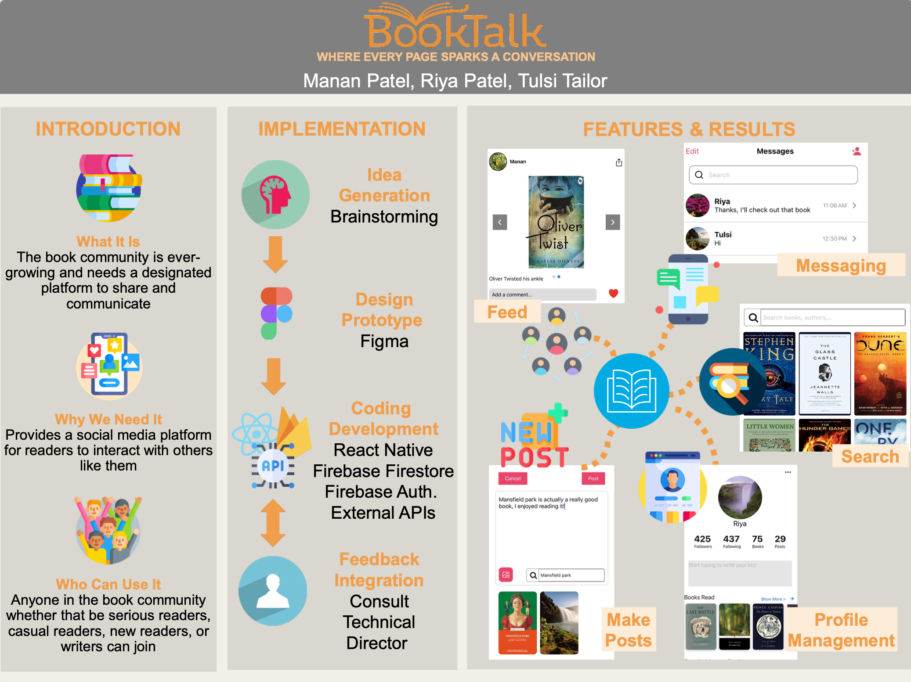

# BookTalk

## Authors

- [Manan Patel](https://github.com/Manan-dev)
- [Riya Patel](https://github.com/rpatel90)
- [Tulsi Tailor](https://github.com/ttulsi01)

## Overview

BookTalk is a mobile application built with React Native and Expo, designed to provide book enthusiasts with a platform to share their thoughts, engage in discussions, and connect with like-minded readers.

## Features

- **User Authentication**: Secure and user-friendly authentication system.
- **Interactive Book Reviews**: Create engaging posts with ratings, comments, and multimedia elements.
- **Social Engagement**: Like, comment, share, and save posts to foster community engagement.
- **User Connections**: Follow other users, build a network of followers, and make connections.
- **Recommendations**: Get personalized book and group recommendations.
- **User Profile**: Display followers/following, private/public reading lists, and custom lists.

## Tech Stack

- **React Native**: Building responsive and user-friendly mobile interfaces.
- **Expo**: Simplifying React Native development and deployment.
- **Firebase Authentication**: Ensuring secure and seamless user experiences.
- **Firebase Firestore**: Reliable and scalable database solution.
- **API Integration**: Collaborating with various external APIs.

## Final Product



## Getting Started

1. **Clone the Repository**:

   ```bash
   git clone git@github.com:Manan-dev/BookTalk.git
   cd BookTalk
   ```

1. **Install Dependencies**:

    ```bash
      npm install
    ```

1. **Run the Application**:

- Android:

  ```bash
    npm run android
  ```

- iOS:

  ```bash
    npm run ios
  ```

## License

This project is licensed under the MIT License.

Happy reading and chatting on BookTalk! 📚🎉
